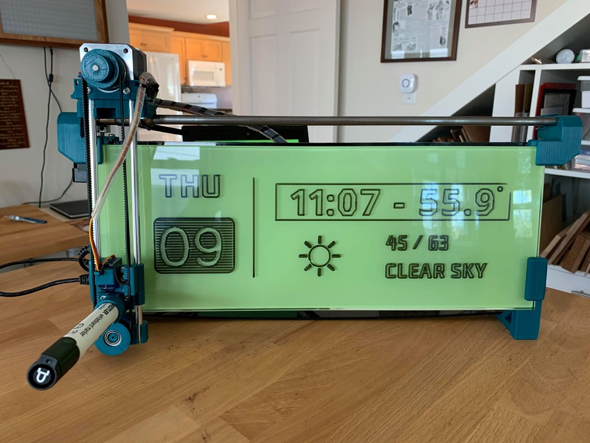

# iBoardBot

I bought an iBoardBot many years ago and have spent some time upgrading the
physical installation but never iterated on the software.  This repo
encapsulates my efforts to improve the general software efforts.

For details on iBoardBot see
their [assembly instructions](https://www.jjrobots.com/iboardbot-assembly-instructions/).
The build is a lot of fun and I would highly recommend getting one.


(Example display produced by the server process and triggered by the weather
client.)

## Server process

To start the server for the first time use:  
```
cd code\server
python3 -m virtualenv --python=python3 env
source env/bin/activate
python3 -m pip install -r requirements.txt
python server.py
```
There are a lot of customizations which can be seen using the *--help* option.  

The server process listens on port 80 by default and will handle requests from
iBoardBot devices as well as control plane requests to manipulate the boards
that are connected to this server.  A queue of requests is maintained for each
board.  The queue is not currently persisted. 

I've implemented super, super simple HTML screens to interact with some (but
not all) of the control plane requests so you can poke around using a web browser.  
In the future the server process can be extended to display images of what the
output would look like prior to 'executing' the requests and putting the work
units into the queue for the boards.  

I find it easier, in development, to use the invocation:
```
python server.py --mockScreen
```
which will show the step-by-step graphical output to a window on the server
machine.  While this won't work great if you are running a server process for
many simultaneous boards it does work really well if you are doing development
near your iBoardBot and you want to iterate quickly.

For a demonstration of the server, an automatically triggering client, and the board working side-by-side then:

1.  Flash the firmware for the iBoardBot found in code\deviceFirmware.  Make sure that you change the code\devicefirmware\iBoardBot\Configuration.h file so that *SERVER_HOST* and *SERVER_URL* are set correctly.
1.  Start the server process on a development machine whose address matches the one that you set in the prior step.
1.  On the same machine (for simplicity) start the weatherClient found in code\weatherClient.  Use the *--help* option to see required arguments and make sure you sign up for an account (free!) in OpenWeather.org.

## Dependencies

Most of the work done here is in Python 3.  If you are using Python 2 then you will have to upgrade.  

The server code uses a few dependencies as captured by the requirements.txt in the various code directories.

* OpenCV Python 4.1.2 - lots of useful graphical manipulations
* Requests library - easier to make http requests
* [freetype-py](https://github.com/rougier/freetype-py) library in order to generate images
for text. 

All fonts included here are available via the SIL Open Font license.  More can 
be found at [Font Squirrel](https://www.fontsquirrel.com/fonts/list/popular).

## Installation in Linux systems

I've moved the server process, along with the periodic weather client, to work on both a Raspberry PI as well as a vanilla Ubuntu box.   In these environments the server processes are all nannied via systemd. 

To 'install' and get the server and weather client working use

```
cd code/server/
./install.sh
cd ../weatherClient/
./install.sh
```

From this point forward the services will be restarted automatically on startup of the Linux box.  To see the logs use

```
sudo journalctl -u boardbot.service -f
```

or 

```
sudo journalctl -u weatherclient.service -f
```

If you want to restart the service process for the boardbot then use:

```
sudo systemctl restart boardbot.service
```

All install.sh scripts also create various useful shortcuts such as 'showLogs.sh' and 'stopService.sh'.  

## Display

I have experimented with hosting the server on the raspberr PI and put a 4" HDMI screen on top of the PI for a simple UI.   I purchased one from Miuzei and used these instructions to get the touch component working.

```
sudo rm -rf LCD-show
git clone https://github.com/goodtft/LCD-show.git
chmod -R 755 LCD-show
cd LCD-show/
sudo ./MPI4008-show
```

